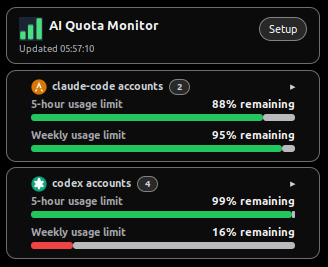
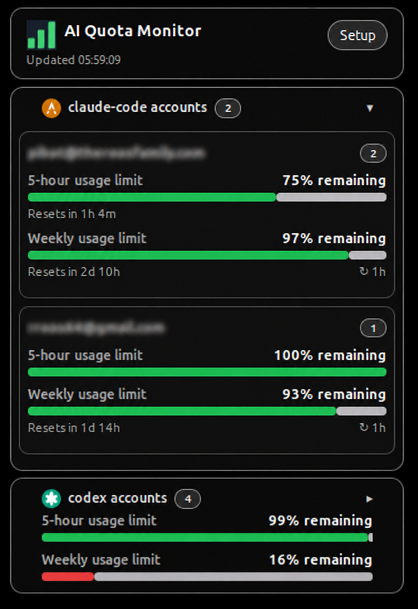
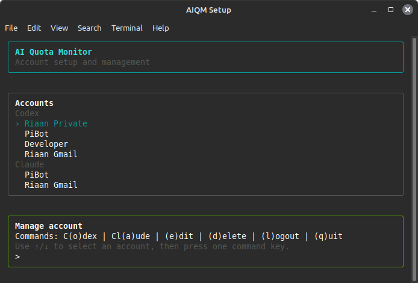

# AI Agent Quota Monitor

[](https://github.com/rroos64/ai-agent-quota-monitor/actions/workflows/ci.yml)

<p align="center">
  
</p>

<p align="center">
  <strong>Stop guessing which AI coding-agent account still has quota.</strong>
</p>

<p align="center">
  
  
  
</p>

AIQM is a local Linux/Cinnamon quota monitor for developers who use multiple AI coding-agent accounts.

It shows your Codex and Claude Code quota windows on the desktop, keeps provider sessions local to your machine, and helps you choose the right account before starting a heavy planning or coding session.

No hosted dashboard. No account rotation. No provider credentials in the desklet. Just a local monitor for the quota limits that actually interrupt your work.

<p align="center">
  
</p>

---

## Why AIQM exists

If you use AI coding agents heavily, quota limits become part of your workflow.

One account is close to its 5-hour limit. Another still has weekly quota. A third is fine for small edits but not for a big planning run. Checking all of that manually means opening dashboards, switching accounts, waiting for usage pages, and breaking the flow you were trying to protect.

I originally built AIQM because I am using pi.dev for most of my AI-assisted development work and kept running into 5-hourly and weekly limits during heavy sessions. Buying more subscriptions solved the quota problem, but created a different one: I now needed to manage several accounts well enough to use the quota I was already paying for.

AIQM puts that information on the desktop.

---

## What AIQM does

* Shows AI coding-agent quota usage in a Cinnamon desklet
* Supports multiple accounts per provider
* Displays provider quota windows such as 5-hour and weekly usage
* Shows visual quota states using simple progress bars
* Supports Codex and Claude Code in the current build
* Keeps the desklet passive and away from credentials
* Uses a local setup TUI for account management
* Polls in the background using a user `systemd` timer
* Applies provider-level poll boundaries (min, max, backoff ratio) with independent per-account progressive back-off
* Keeps static account data visible when an account is not currently in use
* Writes normalised quota state to a local `latest.json` file
* Ranks accounts within each provider group using the No-Brainer Score so the next account to use is always obvious

AIQM is built to answer one practical question:

> Which account should I use next?

---

## Who this is for

AIQM is for developers who:

* use Codex, Claude Code or similar AI coding agents heavily
* maintain more than one provider account or subscription
* want to avoid hitting quota halfway through a coding session
* prefer a local Linux desktop tool over a hosted dashboard
* are comfortable installing a Cinnamon desklet and local CLI

AIQM is probably not for you if you want a hosted team dashboard, billing analytics, automatic account switching or account rotation.

---

## Provider status

| Provider           | Status           | Notes                                                                                            |
| ------------------ | ---------------- | ------------------------------------------------------------------------------------------------ |
| Codex              | Working          | Uses the current Codex app-server transport and the allowlisted `account/rateLimits/read` method |
| Claude Code        | Working, fragile | Uses Anthropic's unofficial OAuth usage endpoint, which may change or disappear without notice   |
| Google Antigravity | Planned          | Next planned provider slice                                                                      |
| Fake provider      | Working          | Used for development, CI and local UI testing                                                    |

Claude Code support is useful, but it is not as stable as Codex support because it depends on an unofficial endpoint.

---

## Screenshots

### Cinnamon desklet

<p align="center">
  
</p>

### Setup TUI

<p align="center">
  
</p>

---

## Requirements

* Linux Mint or LMDE with Cinnamon
* Node.js and npm
* User-level `systemd` services
* Codex and/or Claude Code account access
* A terminal for setup

AIQM is currently designed for local user installation. It should not require `sudo` for normal use.

---

## Quick start

Install AIQM:

```bash
scripts/aiqm-local.sh install
```

Install and open setup immediately:

```bash
scripts/aiqm-local.sh install --launch-setup
```

Then add your accounts from the setup TUI:

```bash
aiqm setup
```

After setup, add the desklet from Cinnamon's desklet settings if it is not shown automatically.

Reload Cinnamon once after desklet code or style changes if Cinnamon has not reloaded it automatically.

---

## Install details

The installer:

* builds the TypeScript helper CLI
* links `~/.local/bin/aiqm`
* installs `~/.local/bin/aiqm-setup-terminal`
* installs the Cinnamon desklet
* installs and enables `aiqm-poll.timer`
* creates app data and cache directories
* creates no dummy or sample accounts

Installed components:

```text
~/.local/bin/aiqm
~/.local/bin/aiqm-setup-terminal
~/.local/share/cinnamon/desklets/ai-agent-quota-monitor@local
~/.config/systemd/user/aiqm-poll.service
~/.config/systemd/user/aiqm-poll.timer
```

---

## Setup TUI

Open setup from the desklet **Setup** button or run:

```bash
aiqm setup
```

Home commands execute immediately:

```text
C(o)dex     Add a Codex/OpenAI account with AIQM-owned browser login
Cl(a)ude    Add a Claude/Anthropic account with AIQM-owned browser login
(e)dit      Edit selected account
(d)elete    Remove selected account from AIQM
(l)ogout    Log selected account out but keep it in the list
(q)uit      Close the TUI and terminal
↑/↓         Select account
```

Edit menu:

```text
(n)ame      Edit display name
(o)rder     Reorder with ↑/↓, Enter saves
(r)e-login  Replace the AIQM-owned provider session via browser login
(l)ogout    Log out but keep account configured
(b)ack      Return home
```

---

## How it works

AIQM has three moving parts:

```text
AIQM setup TUI
  └─ adds accounts and creates AIQM-owned provider sessions

systemd --user aiqm-poll.timer
  └─ runs ~/.local/bin/aiqm poll --json
       └─ writes ~/.local/share/ai-agent-quota-monitor/latest.json

Cinnamon desklet
  └─ reads latest.json only
       └─ renders compact collapsible provider/account cards
```

The desklet is deliberately dumb. It does not read tokens, provider auth homes, raw provider responses, config internals or logs.

That separation is intentional. Provider integrations are fragile and credential-sensitive. The desktop widget should only render display-safe quota state.

---

## Polling and display

Quota refresh is owned by the user `systemd` timer:

```text
aiqm-poll.timer
```

The timer wakes every 60 seconds by default. The helper then decides which individual accounts should actually be polled.

Cooldowns are applied **per account**, not per provider. This matters because quota state can differ account by account:

* one account may be temporarily rate-limited
* one account may be signed out or failing authentication
* one account may not be in active use, so its data is effectively static
* another account from the same provider may still be healthy and worth polling

AIQM keeps the last known account state visible while an account is cooling down or not actively changing. That prevents the desklet from hiding useful information just because a provider account is idle or temporarily failing.

The desklet watches `latest.json` and re-renders when it changes. The desklet also has a legacy poll command setting, but the background timer is the reliable production refresh path.

### Provider-level boundaries

Poll boundaries — minimum interval, maximum interval, and backoff ratio — are defined per provider in the codebase at:

```text
helper/src/providers/poll-defaults.ts
```

These are the authoritative defaults. There are no hard-coded values anywhere else in the polling logic.

| Provider | Min interval | Max interval | Backoff ratio | Backoff progression |
| ------------ | ------------ | ------------ | ------------- | ---------------------------------------------------- |
| Codex | 60 s (1 min) | 1800 s (30 min) | 2.0 | 1 → 2 → 4 → 8 → 16 → 30 min |
| Claude Code | 1800 s (30 min) | 3600 s (60 min) | 1.167 | 30 → 35 → 41 → 48 → 56 → 60 min |

To change defaults for any provider, edit `poll-defaults.ts` directly. No other file needs to change.

### Account-level tracking

Boundaries are set at provider level, but the poll interval is managed independently per account.

Each account starts at its provider minimum. When its quota data is unchanged or its poll returns an error, its own effective interval is multiplied by the provider backoff ratio — up to the provider maximum. When quota data changes, that account's interval resets to the provider minimum immediately.

This means two accounts from the same provider can have different effective intervals at the same time: one that is actively changing quota will poll eagerly, while one that is idle backs off on its own.

AIQM keeps the last known state visible for any account that is cooling down, failing, or temporarily unavailable. The desklet never hides an account just because its poll is deferred.

If a provider returns a `retry-after` header, AIQM honours that value for the affected account even when it exceeds the configured maximum.

### Overrides

Provider min and max can be overridden without touching the codebase via `config.json` settings:

```json
"settings": {
  "providerPollIntervalSeconds": { "codex": 120 },
  "providerPollMaxIntervalSeconds": { "codex": 600 }
}
```

Per-account overrides can be set in that account's `providerConfig` using `pollIntervalSeconds` / `minPollIntervalSeconds` and `pollMaxIntervalSeconds` / `maxPollIntervalSeconds`. Account-level overrides take priority over provider settings, which take priority over `poll-defaults.ts`.

---

## Codex support

Codex quota is read through the current Codex app-server transport and the allowlisted method:

```text
account/rateLimits/read
```

AIQM displays Codex quota windows such as 5-hour and weekly usage.

Codex `credits.hasCredits` is intentionally ignored for quota status because AIQM tracks plan-included usage windows, not OpenAI credits.

---

## Claude Code support

Claude Code support currently uses Anthropic's unofficial OAuth usage endpoint.

That means it works today, but it could break if Anthropic changes the endpoint, response shape, authentication behaviour or access rules.

AIQM handles failures by marking the account stale or unavailable rather than hiding the account.

---

## Account ranking — No-Brainer Score

Every time the polling helper writes `latest.json` it attaches a `selectionRank` to each account. The desklet displays this as a numbered pill next to the provider label. Rank numbers restart per provider, so the best Claude account and best Codex account can both show `1`.

The intended user experience:

```text
Current account runs out.
Open the desklet.
Switch to rank #1.
Keep coding.
```

### The food-expiry mental model

Think of each account as food in the fridge.

The **weekly reset is the best-before date**. Quota that reaches its weekly reset unused is wasted, whether the account has been opened or not. An unopened account with a weekly reset tomorrow may be more important to use than an opened account whose weekly reset is a month away.

The **5-hour reset is the smell test after opening**. Once an account has an active 5-hour window, its short-term quota is already ticking down. Use opened accounts before cracking fresh ones when everything else is similar — but do not blindly prefer opened accounts when their weekly quota is in no danger.

### How the score is calculated

The background polling helper computes a **No-Brainer Score (NBS)** for each account:

```text
NBS = urgency × usefulness × data_confidence
```

**Urgency** combines two pressures:

| Pressure | Formula | Applies when |
|---|---|---|
| Best-before pressure | `weekly remaining % ÷ hours until weekly reset` | Always (when weekly window is known) |
| Opened-window pressure | `5h remaining % ÷ hours until 5h reset` | Only when the 5h window is active and partially used |

The larger pressure dominates; the smaller adds one third of its value. Opened accounts receive a small boost (~5%) as a tie-breaker that keeps "use opened stock first" as a preference without making it a rule.

> **Note:** An account that is opened but has 100% of its 5-hour quota still unused has not started consuming that window yet — there is nothing at risk of expiring, so it contributes no 5-hour pressure. Only the weekly best-before pressure drives its score.

**Usefulness** penalises nearly-empty accounts:

```text
usefulness = min(1, 5h remaining % ÷ 10)
```

Accounts with more than 10% remaining have full usefulness. Below 10% the score scales down proportionally. This is a soft penalty, not a hard cutoff — a nearly-empty account with a very urgent weekly reset can still rank first.

**Data confidence** scales for uncertainty:

| Account status | Confidence |
|---|---|
| Fresh | 1.0 |
| Stale | 0.5 |
| Unavailable / error | 0 — not ranked |

### Exhausted accounts

An account is exhausted and receives no rank when:

* 5-hour remaining is 0%
* Weekly remaining is 0% — including the case where the 5-hour bucket appears full but the weekly allowance is spent

### Worked examples

| Situation | Winner | Why |
|---|---|---|
| Account A: opened, 5h=60% with 2h left, weekly reset in 20 days. Account B: fresh reserve, same weekly reset. | A | A has active 5-hour decay. The quota is about to run out in this window; use it now. |
| Account A: opened, 5h=100% with 4h left, weekly reset in 30 days. Account B: unopened, weekly reset tomorrow. | B | B's weekly quota is about to go to waste. A is full and not at risk. |
| Account A: 4% remaining, 30 min left. Account B: 40% remaining, 3h left. | B | A is too depleted to be the next account despite its urgency. |
| Account A: 8% remaining, weekly reset in 1h, weekly=80%. Account B: fresh reserve, weekly reset in 20 days. | A | A's weekly waste risk is enormous. The 10% penalty is outweighed. |

---

## Local storage layout

AIQM stores local state under your user account:

```text
~/.local/share/ai-agent-quota-monitor/config.json
~/.local/share/ai-agent-quota-monitor/latest.json
~/.local/share/ai-agent-quota-monitor/history.log
~/.local/share/ai-agent-quota-monitor/logs/aiqm.log
~/.local/share/ai-agent-quota-monitor/providers/codex/<email>/codex-home/auth.json
~/.cache/ai-agent-quota-monitor/
~/.local/share/cinnamon/desklets/ai-agent-quota-monitor@local
~/.local/bin/aiqm
~/.local/bin/aiqm-setup-terminal
~/.config/systemd/user/aiqm-poll.{service,timer}
```

This file is credential-bearing and must never be committed or shared:

```text
~/.local/share/ai-agent-quota-monitor/providers/codex/<email>/codex-home/auth.json
```

Treat provider auth homes like passwords.

---

## Security model

AIQM is local-first.

It does not run a hosted service and does not send your quota data to an AIQM server.

Provider sessions and quota state stay on your machine. Some files are credential-bearing, especially provider auth homes. Do not paste, upload, commit or share them.

The Cinnamon desklet only reads normalised quota state from:

```text
~/.local/share/ai-agent-quota-monitor/latest.json
```

The desklet does not read:

* provider auth files
* tokens
* cookies
* raw provider frames
* logs
* Codex auth homes
* Claude credentials

Do not commit or paste credential-bearing files, raw provider frames, auth URLs, cookies, tokens, device codes, Codex auth homes, Claude credentials, or logs containing raw provider output.

See:

```text
docs/security.md
```

---

## Uninstall

Preserve local data:

```bash
scripts/aiqm-local.sh uninstall
```

Remove app data and cache too:

```bash
scripts/aiqm-local.sh uninstall --purge-data
```

Use `--purge-data` carefully. It removes local AIQM state and provider session data managed by AIQM.

---

## Development

Run the full development checks:

```bash
npm run ci
npm run validate:dev-flow
```

These run typecheck, lint, formatting, tests, build and repository layout validation.

---

## Development philosophy

This project favours test-first development and requirement traceability.

The goal is not vanity line coverage. The goal is confidence that the product does what the requirements say it should do.

Tests should trace back to a business requirement, acceptance criterion or technical specification. Work starts with clear normal-English intent, then failing tests, then implementation.

That discipline matters more when coding with AI agents, not less. Without clear requirements and tests, agents produce confident code that may solve the wrong problem.

---

## Limitations

AIQM is early and intentionally local.

Known limitations:

* Claude Code support depends on an unofficial Anthropic endpoint
* Google Antigravity support is planned but not implemented yet
* AIQM does not manage billing, credits or subscriptions
* AIQM does not automatically switch or rotate accounts
* Provider quota systems may change without notice
* Linux/Cinnamon is the target desktop environment

---

## Roadmap

Planned areas:

* Google Antigravity provider support
* stronger provider diagnostics
* improved install and update flow
* better stale/error explanations
* optional privacy mode for screen-sharing
* potential Cinnamon Spices distribution path

---

## Licence

MIT License. See [LICENSE](LICENSE).
